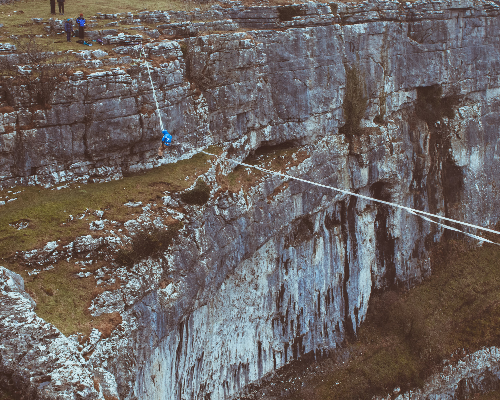

# Writing Software is Hard

It's no secret - there are literally thousands of articles, collecting the opinions of generations of developers on why exactly writing software is so hard. It's hard. And clearly, getting other people to understand why it's so hard is also hard, that's why we keep doing it. Clausehound has an energetic, hard-working team of devs who I see do great work every day. I'd like to share a bit of our perspective on this eternal struggle.

Abstractions are also harder to think about than concretions -- the details involved in making something that actually does something. Before you commit code to the product, it lives in this perfect space between the ears of everyone involved. The CEO can see how this will build their company and make them a success. The client feels confident they've made the right choice; clearly after so many meetings and dilligent minute-taking, the picture they have in their head that they feel so good about is shared by everyone. The developers are excited they get a chance to build something new, and are looking forward to showing off to their friends and family.

I'll leave it there for now -- let's keep it optimistic! There are too many "how a project goes to hell" posts out there already, and for the most part projects don't _need_ to fall apart. I'd argue that even in cases of poor communication, mismanagement, and outright shoddy programming, what gets delivered is usually _somebody's_ idea of what they wanted to see made. Or it's half one person's vision and half another's.

# Working with Abstractions: Analogy vs Stories

Remember when I said abstractions are hard? Well, analogies for software are even worse. We all want to be innovative. We all love that rush of excitement that comes when you discover or create something new. We'll start down this path where we say "how can I explain this entirely new concept so people understand it?", and naturally figure out some analogy that technically fits. The only thing possibly less helpful is the elevator-pitch darling of "we're [product X] for [Y]!", which should never be used ever again. You know what the "Facebook for X" is? Facebook.

Developers have known this for decades, and have found that [working with stories](https://www.atlassian.com/agile/project-management/user-stories) makes much more sense than analogies. Software never exists in a vacuum on its own, merely to be admired. It's part of something. A personal story. A **U**ser e**X**perience. UX, not just UI. And in our case, always UX over UI. My dozen open tabs, search engines, email, calendar, etc. are all just as much a part of how I use any app as the app itself.

# Abstractions into Requirements
## and why I'm a hypocrite

After spending a paragraph railing against analogies, guess what it's time for? An analogy! But I'm using this analogy to tell a story, so I can live with that. Let's do one about say.. building a bridge. Why building bridges, when I've never in my life built a bridge? Because I'm fairly certain you haven't built one either, and won't be as quick to notice any of my flaws in structural engineering.

I went to school to learn about software, and everyone in this field loves to talk about **requirements**. A requirement is what you need the software to do, right? Sometimes true, but usually it's not what the software requires, it's what the user requires.

So I want to cross a chasm - that's my requirement. "I require the means to cross this chasm". When you leave it there, you get anything. A zipline to slide across, a rope bridge, or the Golden Gate. All of those fit the bill. Each one of those could appear in the head of the CEO, client, and developer during their "requirements elicitation meeting". If the client wanted the rope bridge, but got the zipline, they'd feel shortchanged. It they got the Golden Gate bridge, they'd be upset at the high cost and long delays. Though they may cool down when it triggers their nostalgia for Full House.

Again why talking in stories and experiences makes more sense. What software is required to do is extraordinarily hard to pin down, because the effort required may range from trivial to infinite. "I want to make a todo list". Okay -- open notepad, write "to-do" at the top. Done. Or write an app for iOS, Android, and AWS-hosted web that integrates seamlessly with your calendar, uses machine learning to identify ways to save you time on your list, auto-fills contacts to contact people to help you with items on that list, etc. Actually I'm liking the sound of that -- maybe there's another startup there for me.

# Details as Implementation
## or why we never build bridges

Software is like little else we "build", in that you never ever need to build something that's been built before. We're not building bridges. There's no great analogy either. Software is software. It's a very good description of what to do that machines can use to do that thing. You have maybe 10% of a hunch as to what you're actually going to build before you build it. Anyone who tells you different is either lying or is going to fail spectacularly very soon.

And yet, the industry is massive, innovating, "changing the world", etc. so clearly we've figured out some way to get it done. More than any book, tool, technique, paradigm, etc., what we all need is a bit of humility. Everyone will make mistakes -- overemphasize something we learn later we don't care that much about, or think something will be simple to write that it turns out is very difficult. Good systems, and our dev team, works by taking ownership of those errors and communicating. The story evolves, the conversation develops over time. It's never about credit and blame, but innovation and understanding.

At Clausehound, we take an Agile approach, and in legal tech in particular the "individuals and interactions over processes and tools" (first bullet) of the [Agile Manifesto](https://agilemanifesto.org/) rings most true. All tooling exists to support the goal of our interactions, not the other way around. Scrum vs Kanban is a great discussion for another time -- we like [kanban](https://blog.trello.com/kanban-data-nave), as we've found the "sprint" approach of scrum makes less sense when we're not constantly looking at launch cycles. Improving legal tech, understanding contracts, how lawyers' brains work, is a constant conversation and happens across our team and clients every day.
